# 📦 Hope Chain - Donation DApp

블록체인 기반 기부 DApp (Decentralized Application)  
Solidity 스마트 컨트랙트 + Web3.js 프론트엔드 + Ganache 로컬 블록체인 환경에서 개발한 투명한 기부 서비스

---

## 🌟 주요 기능

- ✅ 스마트 컨트랙트 기반 기부 처리
- ✅ 관리자(Admin), 소유자(Owner) 역할 구분 및 권한 관리
- ✅ 출금, 관리자 추가/제거 등 권한별 기능 제공
- ✅ 프론트엔드에서 기부 내역 및 실시간 상태 조회
- ✅ Web3.js로 Ganache 로컬 블록체인과 직접 연동

---
## 🛠️ 개발 환경

| 항목             | 내용                          |
|-----------------|-----------------------------|
| Solidity        | 0.8.10 (Remix IDE 사용)        |
| Ganache         | v2.7.1 (로컬 블록체인)          |
| 프론트엔드      | HTML, CSS, JavaScript, Web3.js |
| Web3.js         | CDN 불러오기  |
| 배포            | Remix IDE → Ganache로 배포    |

---

## 🚀 실행 방법

1️⃣ **스마트 컨트랙트 배포**  
- Remix IDE에서 `Donation.sol`을 컴파일  
- Remix의 Deploy 탭에서 Ganache 네트워크에 연결  
- 컨트랙트 배포 → 생성된 컨트랙트 주소 복사

2️⃣ **프론트엔드 준비**  
- `index.html`, `style.css`, `app.js`를 같은 폴더에 둠
- `app.js` 내 `contractAddress`에 배포된 주소로 교체
-  Remix compile 탭 하단에 생성된 ABI를 복사하여 `app.js` 내 `contractABI`에 할당
- `web3`는 Ganache RPC (예: `http://127.0.0.1:8545`)에 연결

3️⃣ **실행**  
- 로컬에서 HTML 열기 
- 기부, 출금, 관리자 추가/제거 등 기능 테스트

---
## 결과 화면

| 서비스 아키텍처                   | 시퀀스 다이어그램 : 기부 플로우                  |
|------------------------------|-------------------------------|
| 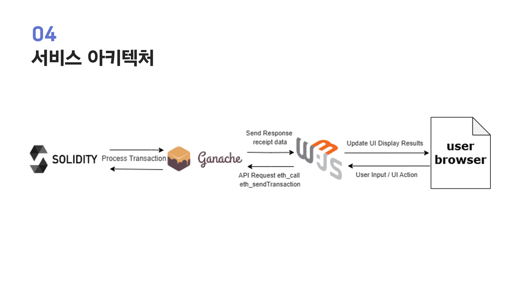      | 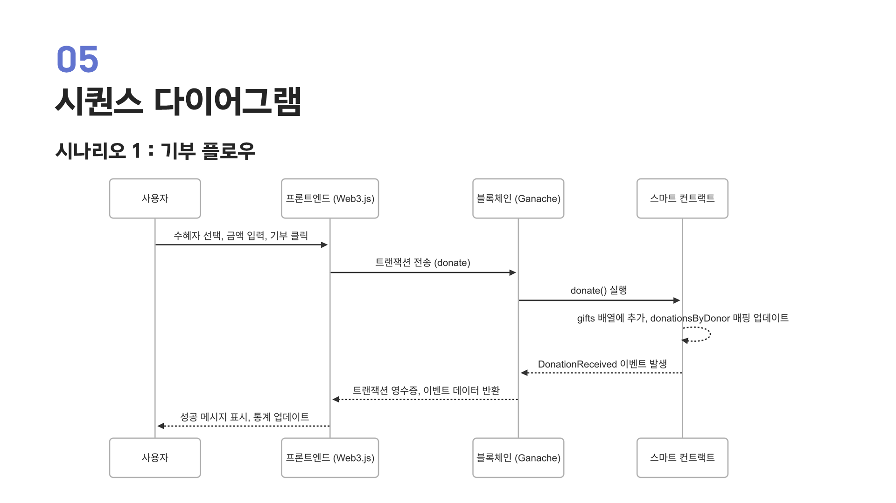       |

| 시퀀스 다이어그램 : 관리자 출금            | 시퀀스 다이어그램 : 관리자,소유자 권한 관리                 |
|------------------------------|-------------------------------|
| 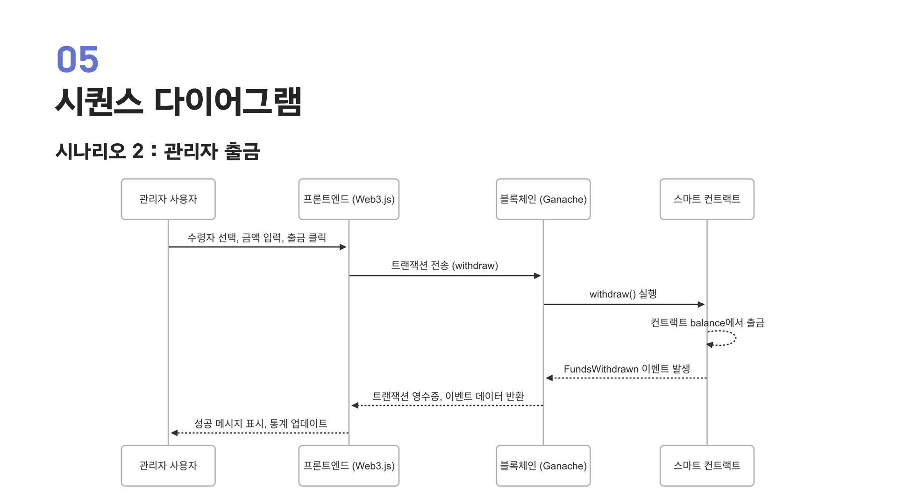      | 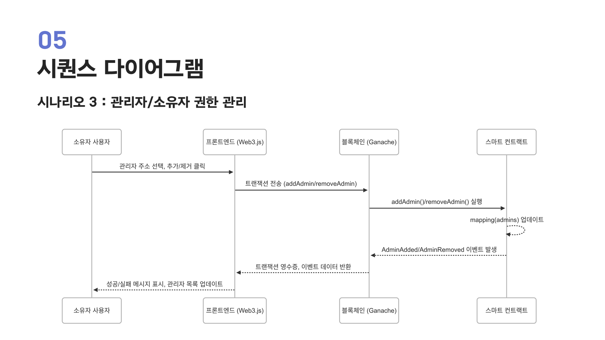       |

| 지갑 주소로 권한 구별                | 사용 가이드 첨부                    |
|------------------------------|-------------------------------|
| 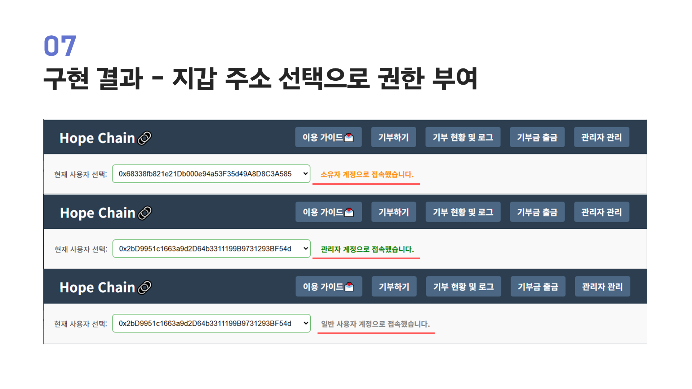    | 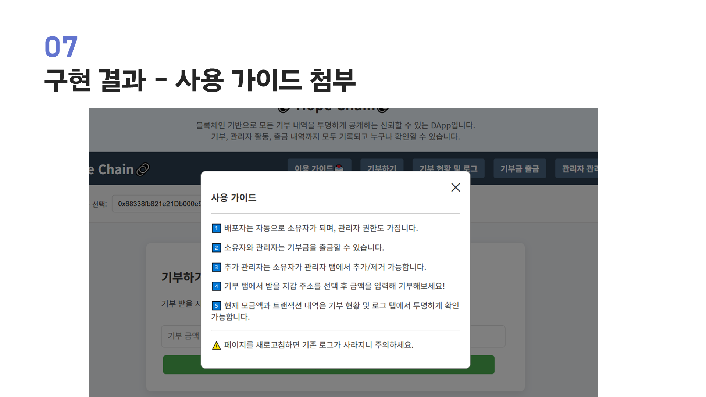     |

| 기부 성공 화면                     |기부 성공 로그                   |
|------------------------------|-------------------------------|
| 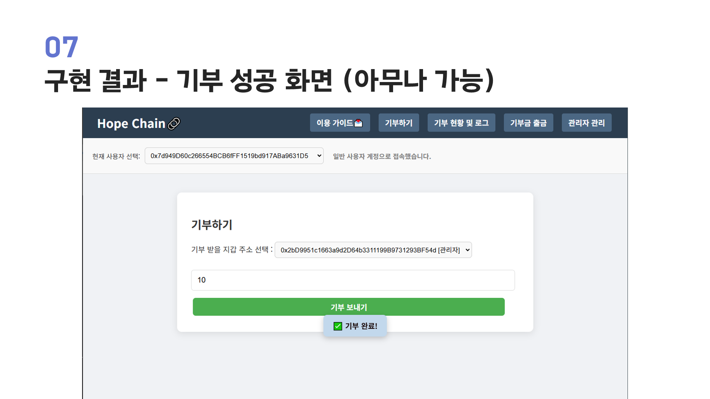      | 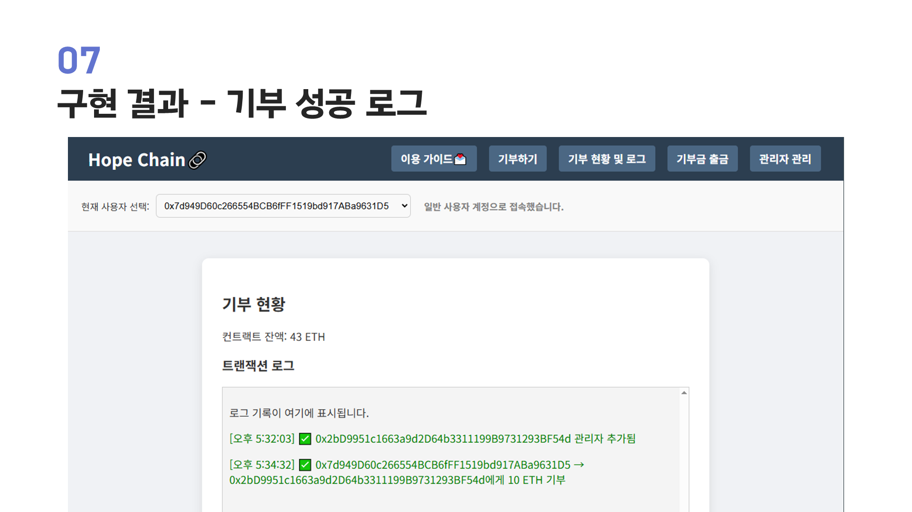       |

| 관리자 계정으로 기부금 출금               | 현재 관리자 목록                 |
|------------------------------|-------------------------------|
| 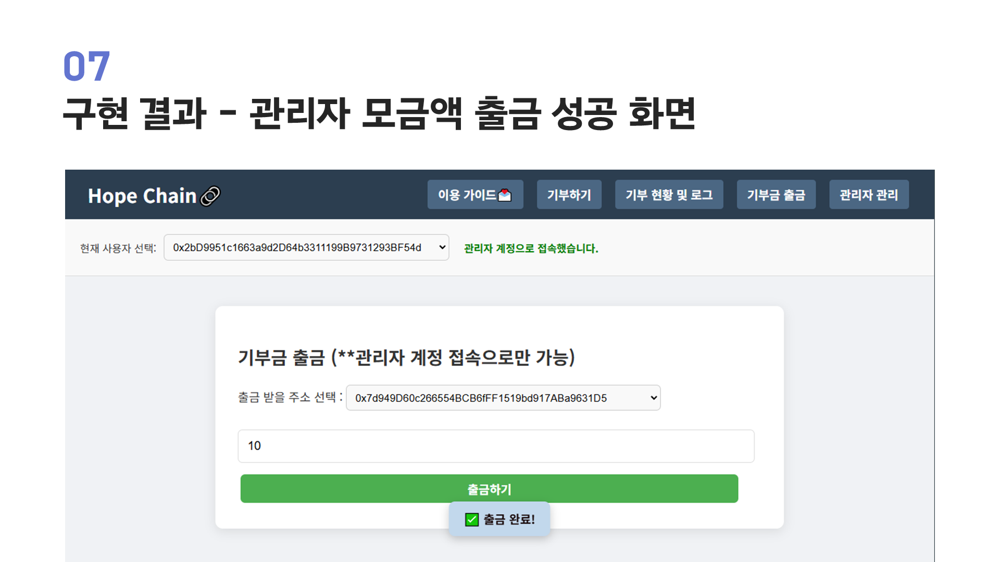      | 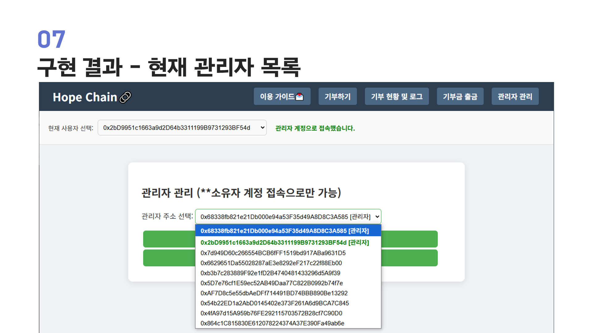       |

| 소유자 -> 관리자 권한 부여                | 이벤트 로그                    |
|------------------------------|-------------------------------|
| 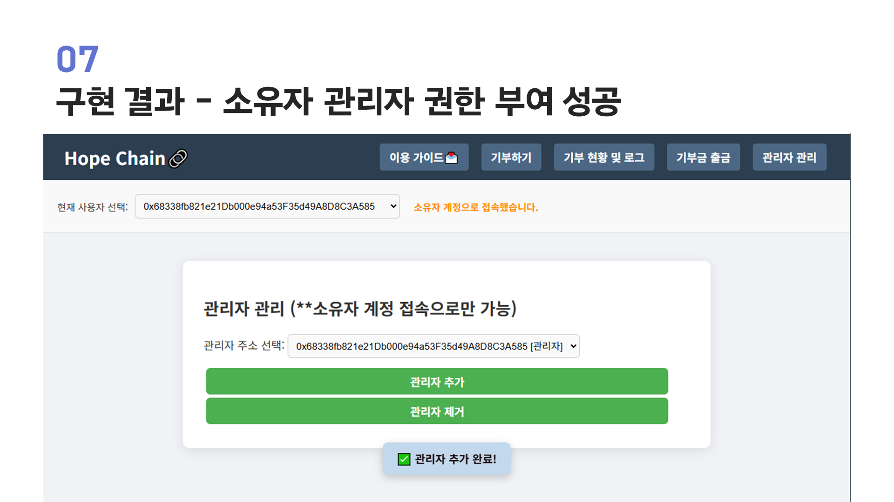      | 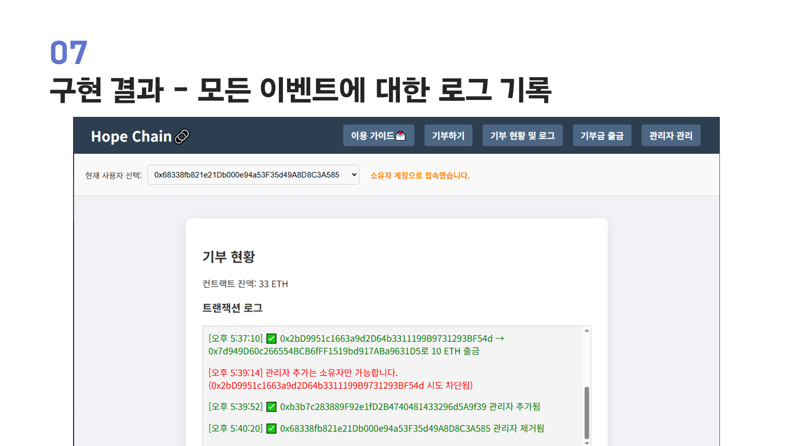       |

---

## ✨ 배운 점 & 목표

- Solidity, Web3.js, Ganache를 처음 사용해 블록체인 DApp을 직접 만들어봄
- 스마트 컨트랙트의 투명성과 변경 불가능성에 기반한 신뢰성 있는 기부 시스템 설계
- 프론트엔드에서 블록체인 연동까지의 전체 개발 플로우 학습

---
## 📄 라이선스

MIT License
